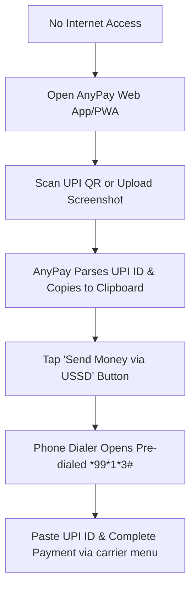

# ⚡ AnyPay — Offline UPI Payments

AnyPay is a premium, lightweight, offline-first Progressive Web App (PWA) designed to facilitate UPI payments without an internet connection. By bridging QR scanning with India's national USSD gateway (`*99#`), AnyPay makes digital payments accessible anywhere, even in network-dead zones.

---

## ✨ Features

- **📶 Offline-First Architecture**: Powered by a Service Worker that caches all app assets (JS, CSS, HTML, icons, QR scanning library) for 100% offline usability.
- **📸 Instant QR Code Scanning**: Scan UPI QR codes directly using your device's camera or upload a QR image/screenshot from your gallery.
- **📋 Automatic Copy & Extraction**: Instantly parses UPI deep links (`upi://pay`), extracts the UPI ID, amount, and payee name, and copies them to the clipboard.
- **📞 Smart USSD Linking**: Direct dialer triggers for the NUUP network:
  - **Send Money**: Pre-configured USSD code (`*99*1*3#`) ready to receive the pasted UPI ID.
  - **Check Balance**: Quick check via `*99*3#`.
- **📲 Cross-Platform PWA Support**: Custom install prompts and guides optimized for:
  - **Android**: Direct in-app installation.
  - **iOS (Safari)**: Actionable modal showing how to "Add to Home Screen".
  - **Desktop**: Guided desktop app installation.
- **🎨 Premium Dark Theme**: Sleek, glassmorphic UI built with Tailwind CSS v4 and fluid animations.

---

## 🛠️ Tech Stack

- **Framework**: React 19 + TypeScript + Vite
- **Styling**: Tailwind CSS v4 + Vanilla CSS Custom Tokens
- **PWA & Caching**: `vite-plugin-pwa` (Workbox)
- **QR Engine**: `jsQR` (dynamically loaded for fast initial paints)
- **Icons**: `lucide-react`

---

## 🚀 How It Works



1. **Scan**: Point your camera at any UPI QR code, or upload a photo/screenshot of a QR code.
2. **Extract**: The app instantly extracts details (UPI ID, name, transaction amount) and copies the UPI ID to your clipboard.
3. **Dial**: Tap **Send Money via USSD** to launch your phone's dialer with `*99*1*3#`.
4. **Pay**: Paste the UPI ID when prompted by your carrier, enter the amount, and authorize the payment securely with your UPI PIN.

---

## 💻 Local Development

### 1. Installation
Clone the repository and install dependencies:
```bash
git clone https://github.com/Sambhav-gg/AnyPay.git
cd AnyPay
npm install
```

### 2. Running the Dev Server
Start the Vite development server:
```bash
npm run dev
```

### 3. Production Build & PWA Testing
To build the application and compile the service worker:
```bash
npm run build
```
To preview the production build locally (ideal for testing PWA install prompts and offline capabilities):
```bash
npm run preview
```

---

## 🔒 Security & Privacy

- **Fully Client-Side**: All parsing, QR code reading, and data extraction occur entirely within your browser sandboxed environment. No backend server is involved.
- **Zero Tracker Policy**: AnyPay does not store, log, or transmit your UPI IDs, payee names, or payment amounts.
- **USSD Security**: Payments are processed through the official national NUUP network (`*99#`) operated by NPCI (National Payments Corporation of India), secured by your bank-registered SIM and UPI PIN.
